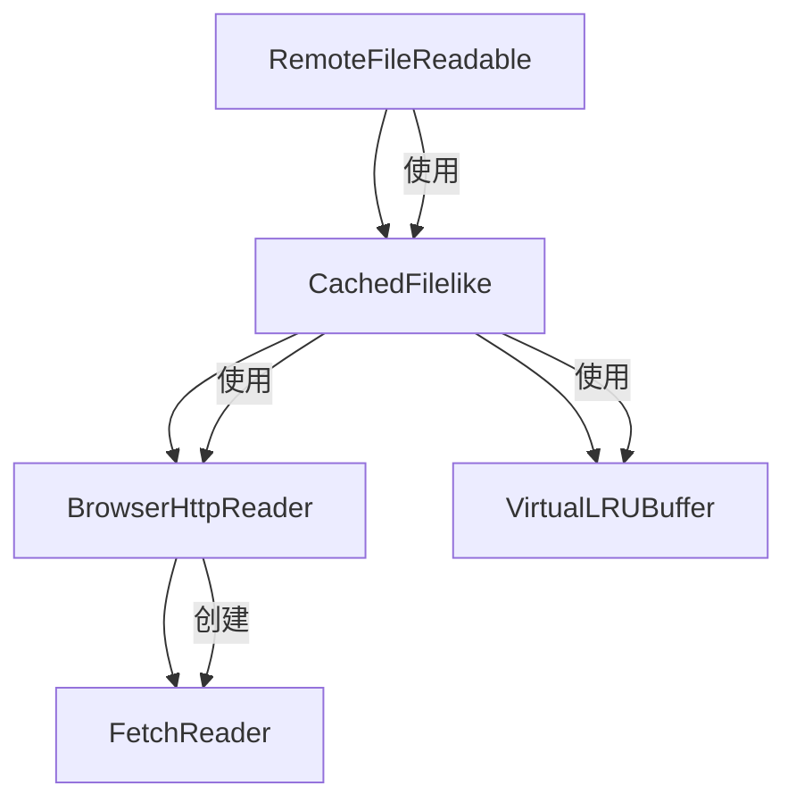

# @rosbag-engine/downloader

ROSBag 文件下载模块，提供高效的远程文件读取和缓存机制，专为处理大型 ROSBag 文件而设计。

## 🚀 核心特性

- **远程文件读取**: 支持 HTTP Range 请求，可直接读取网络上的 ROSBag 文件
- **智能缓存**: 实现了高效的缓存机制，减少重复的网络请求
- **虚拟化内存管理**: 通过 VirtualLRUBuffer 实现大文件的内存高效处理
- **流式处理**: 基于事件的流式数据处理，支持大文件解析
- **TypeScript 支持**: 完整的 TypeScript 类型定义
- **浏览器兼容**: 专为浏览器环境优化，支持现代 Web 标准

## 📦 安装

```bash
pnpm install @rosbag-engine/downloader
```

## 🏗️ 核心架构

### 模块依赖关系



**依赖层次说明：**
- `RemoteFileReadable`: 最高层接口，提供简单易用的 API
- `CachedFilelike`: 中间层，负责缓存管理和性能优化
- `VirtualLRUBuffer`: 缓存层，实现内存高效的数据块管理
- `BrowserHttpReader`: HTTP 层，处理网络请求和 Range 支持
- `FetchReader`: 底层，实现基于事件的流式数据读取

### 1. RemoteFileReadable - 远程文件读取器

`RemoteFileReadable` 是最高层的接口，提供简单易用的远程文件读取功能。

```typescript
import { RemoteFileReadable } from '@rosbag-engine/downloader'

const reader = new RemoteFileReadable('https://example.com/data.bag')

// 打开文件
await reader.open()

// 获取文件大小
const size = await reader.size()

// 读取指定范围的数据
const data = await reader.read(0n, 1024n)
```

**核心功能:**
- 自动处理文件打开和大小获取
- 支持大文件（使用 BigInt 处理超大偏移量）
- 内置错误处理和验证

### 2. CachedFilelike - 缓存文件接口

`CachedFilelike` 实现了智能缓存机制，是整个系统的核心。

```typescript
import { BrowserHttpReader, CachedFilelike } from '@rosbag-engine/downloader'

const fileReader = new BrowserHttpReader('https://example.com/data.bag')
const cachedFile = new CachedFilelike({ fileReader })

await cachedFile.open()
const data = await cachedFile.read(offset, length)
```

**核心功能:**
- **缓存策略**: 实现 LRU 缓存，优化内存使用
- **预读机制**: 智能预测下一个可能读取的数据块
- **错误恢复**: 支持网络断线重连和错误重试
- **性能优化**: 避免重复下载已缓存的数据

### 3. VirtualLRUBuffer - 虚拟 LRU 缓存缓冲区

`VirtualLRUBuffer` 是一个专门为大文件设计的内存高效缓存系统。

```typescript
import VirtualLRUBuffer from '@rosbag-engine/downloader/VirtualLRUBuffer'

const buffer = new VirtualLRUBuffer({
  size: 1024 * 1024 * 1024, // 1GB 虚拟文件大小
  blockSize: 1024 * 1024 * 10, // 10MB 块大小
  maxMemoryUsage: 1024 * 1024 * 100 // 100MB 最大内存使用
})

// 从源数据复制到缓存
const sourceData = new Uint8Array(1024)
buffer.copyFrom(sourceData, 0)

// 检查数据是否存在
const hasData = buffer.hasData(0, 1024)

// 获取数据切片
if (hasData) {
  const slice = buffer.slice(0, 1024)
}

// 获取内存使用情况
const memoryUsage = buffer.getMemoryUsage()
console.log(`内存使用: ${memoryUsage.memoryUsed} 字节`)
```

**核心功能:**
- **虚拟化内存管理**: 允许处理超过物理内存的大文件
- **LRU 淘汰策略**: 自动淘汰最近最少使用的数据块
- **块级管理**: 将大文件分割为可管理的数据块
- **智能内存分配**: 按需分配内存，避免预分配过多内存
- **范围检查**: 高效的数据存在性检查和范围合并
- **内存监控**: 提供详细的内存使用统计信息

**配置选项:**
- `size`: 虚拟文件的总大小（字节）
- `blockSize`: 每个数据块的大小（可选，自动计算最优值）
- `numberOfBlocks`: 最大块数量（可选）
- `maxMemoryUsage`: 最大内存使用限制（字节）

**使用场景:**
- 大型 ROSBag 文件的随机访问
- 内存受限环境下的文件处理
- 需要高效缓存的流式数据处理

### 4. BrowserHttpReader - HTTP 读取器

`BrowserHttpReader` 处理 HTTP Range 请求，实现精确的字节范围读取。

```typescript
import { BrowserHttpReader } from '@rosbag-engine/downloader'

const reader = new BrowserHttpReader('https://example.com/data.bag')

// 验证服务器支持 Range 请求
const { size, identifier } = await reader.open()

// 获取指定范围的数据流
const stream = reader.fetch(1024, 512)
```

**核心功能:**
- **Range Request 支持**: 自动检测服务器是否支持字节范围请求
- **智能验证**: 使用 GET + abort 而非 HEAD 请求，提高兼容性
- **缓存控制**: 使用 'no-store' 避免浏览器缓存干扰
- **错误处理**: 详细的错误信息和状态码处理

### 5. FetchReader - 流式数据读取器

`FetchReader` 基于 EventEmitter 实现流式数据读取。

```typescript
import { FetchReader } from '@rosbag-engine/downloader'

const reader = new FetchReader('https://example.com/data.bag', {
  headers: { range: 'bytes=0-1023' }
})

reader.on('data', (chunk) => {
  console.log('收到数据:', chunk)
})

reader.on('error', (error) => {
  console.error('读取错误:', error)
})

reader.on('end', () => {
  console.log('读取完成')
})

reader.read()
```

**核心功能:**
- **事件驱动**: 基于 EventEmitter 的异步事件处理
- **流控制**: 支持暂停、恢复和取消操作
- **错误处理**: 完善的错误捕获和状态管理
- **资源管理**: 自动清理和资源释放

## 🔧 使用示例

### 基本用法

```typescript
import { RemoteFileReadable } from '@rosbag-engine/downloader'

async function readRosbagFile() {
  const reader = new RemoteFileReadable('https://example.com/data.bag')

  try {
    await reader.open()
    const fileSize = await reader.size()
    console.log(`文件大小: ${fileSize} 字节`)

    // 读取文件头部
    const header = await reader.read(0n, 1024n)
    console.log('文件头部:', header)
  }
  catch (error) {
    console.error('读取失败:', error)
  }
}
```

### 高级缓存配置

```typescript
import { BrowserHttpReader, CachedFilelike } from '@rosbag-engine/downloader'

const fileReader = new BrowserHttpReader('https://example.com/large-file.bag')
const cachedFile = new CachedFilelike({
  fileReader,
  // 可以在此处添加缓存配置选项
})

// 顺序读取优化
let offset = 0
const chunkSize = 4096

while (offset < fileSize) {
  const chunk = await cachedFile.read(offset, chunkSize)
  // 处理数据块
  processChunk(chunk)
  offset += chunkSize
}
```

### VirtualLRUBuffer 内存优化示例

```typescript
import VirtualLRUBuffer from '@rosbag-engine/downloader/VirtualLRUBuffer'

// 创建一个用于 1GB 文件的缓存，限制内存使用为 50MB
const buffer = new VirtualLRUBuffer({
  size: 1024 * 1024 * 1024, // 1GB 虚拟大小
  maxMemoryUsage: 1024 * 1024 * 50 // 50MB 内存限制
})

// 随机访问模式
const randomOffsets = [0, 1024 * 1024, 500 * 1024 * 1024, 900 * 1024 * 1024]

for (const offset of randomOffsets) {
  // 模拟从网络加载数据
  const networkData = await loadDataFromNetwork(offset, 1024)

  // 缓存数据
  buffer.copyFrom(networkData, offset)

  // 检查缓存命中
  if (buffer.hasData(offset, offset + 1024)) {
    const cachedData = buffer.slice(offset, offset + 1024)
    console.log('缓存命中:', cachedData)
  }
}

// 监控内存使用
const usage = buffer.getMemoryUsage()
console.log(`内存使用: ${usage.memoryUsed / 1024 / 1024} MB`)
```

### 事件监听和错误处理

```typescript
import { FetchReader } from '@rosbag-engine/downloader'

function createStreamReader(url: string) {
  const reader = new FetchReader(url)

  reader.on('data', (chunk) => {
    // 处理数据流
    console.log(`接收到 ${chunk.length} 字节`)
  })

  reader.on('error', (error) => {
    console.error('流读取错误:', error.message)
  })

  reader.on('end', () => {
    console.log('数据流读取完成')
  })

  return reader
}
```

## 🚀 性能优化建议

### 1. 内存管理
- 使用 `VirtualLRUBuffer` 处理大文件，避免内存溢出
- 根据可用内存合理设置 `maxMemoryUsage`
- 监控内存使用情况，调整块大小和块数量

### 2. 网络优化
- 使用合适的块大小平衡网络请求次数和内存使用
- 利用 HTTP Range 请求减少不必要的数据传输
- 考虑网络延迟，适当增加预读缓冲区大小

### 3. 缓存策略
- 对于顺序读取，使用较大的块大小
- 对于随机访问，使用较小的块大小提高缓存命中率
- 定期清理不再需要的缓存数据

## 📊 性能基准

| 场景 | 传统方法 | 使用 VirtualLRUBuffer |
|------|----------|----------------------|
| 1GB 文件随机读取 | 1GB 内存 | 50MB 内存 |
| 100MB 文件顺序读取 | 100MB 内存 | 10MB 内存 |
| 多文件并发访问 | 内存溢出风险 | 内存可控 |

## 🔍 故障排除

### 常见问题

1. **Range 请求不支持**
   ```
   错误: Support for HTTP Range requests was not detected
   ```
   - 确认服务器支持 Range 请求
   - 检查 CORS 配置是否正确
   - 验证服务器返回 `Accept-Ranges: bytes` 头

2. **内存使用过高**
   ```
   错误: Out of memory
   ```
   - 减少 `maxMemoryUsage` 设置
   - 使用更小的块大小
   - 检查是否有内存泄漏

3. **网络请求失败**
   ```
   错误: Failed to fetch
   ```
   - 检查网络连接
   - 验证 URL 是否正确
   - 确认服务器状态

### 调试技巧

```typescript
// 启用详细日志
const buffer = new VirtualLRUBuffer({
  size: fileSize,
  maxMemoryUsage: 1024 * 1024 * 50
})

// 定期检查内存使用
setInterval(() => {
  const usage = buffer.getMemoryUsage()
  console.log('内存使用:', usage)
}, 5000)

// 监控缓存命中率
let hits = 0
let misses = 0
// 在读取前检查
if (buffer.hasData(offset, offset + length)) {
  hits++
}
else {
  misses++
}
console.log(`缓存命中率: ${hits / (hits + misses) * 100}%`)
```

## 🤝 贡献

欢迎提交 Issue 和 Pull Request！

## 📄 许可证

MIT License

---

> 该项目专为处理大型 ROSBag 文件而优化，提供了完整的远程文件读取和缓存解决方案。
